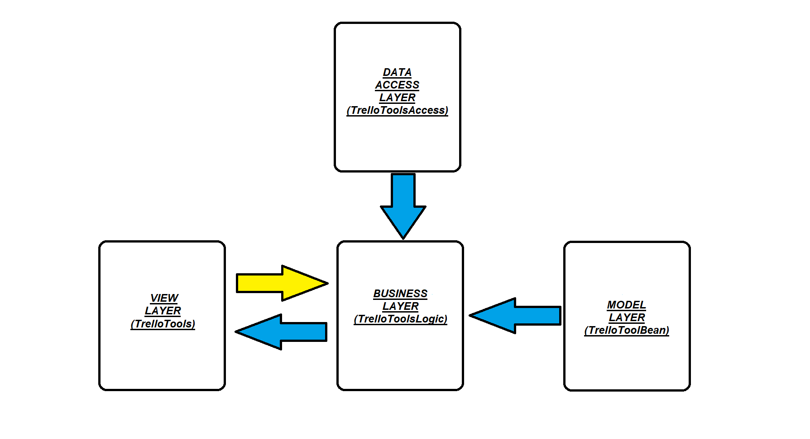

<h1 align="center">TrelloTools (Outlook Add-In) 👋</h1>

  
  

>   <b>Trello Tools</b> is an Add-In for Outlook application for adding cards into your boards in one click. In detail, this tool permits you to:
> - Connecting your Trello account;
> - Adding card into different views define in a specific board;
> - Adding some details to a specific card like: Title, description and attachments;
> - Attaching email you're viewing to a card.  

## Demo

 

## Setup and Installation
First all, click on the latest release present into "Releases" section inside repository page. Then, download only zipped folder called "TrelloTools_Setup.zip" and extract it wherever path you want. 
Open your Outlook application, and follow these steps:
<ul>
<li>Click "File" tab and then on "Options" label (at the bottom of that page);</li>
<li>Then, click on "Add-ins" label;</li>
<li>Into "Manage" section, you must choose from dropdown the value: "COM Add-ins" (it should be set by default) and then you must click on "Go..." button;</li>
<li>Into form that appears at video, click on "Add" button and select the EXE called "setup" inside "TrelloTools_Setup" folder and click on "OK" button;</li>
<li>It should be appeared, on screen, the window for installation of the Add-In, you must only click first on "Install", then on "Close" button, in the end on "Ok" button to close Add-In window;</li>
<li>In the end, restart your Outlook and enjoy with this Add-In.</li>
</ul>

<u>It's important to say: the Add-In you can use it only when expand a single email.</u>

For use the plugin, you must know your Trello API credentials.
If you don't have them, you can read and following the first two paragraphs of this article to generate: <a href="https://developer.atlassian.com/cloud/trello/guides/rest-api/api-introduction/" target="_blank">API Introduction</a>.

<b>NOTE</b>: The Add-In doesn't memorize externally your API credentials. These data will store into user storage and retrieve when application must do data about Boards, Views, and others similar operations.
At the same time, it's possible that Trello can register the whole activity that you'll do.
If you need to know more view their Privacy Policy at this link: <a href="https://www.atlassian.com/legal/privacy-policy#what-this-policy-covers" target="_blank" />Trello Privacy Policy</a>.

## Architecture

The architecture of this project is based on four layers:
- <i>View Layer (Trello Tools)</i> = This layer provides to build and manage layout of Add-In and form about the different functionalities;
- <i>Business Layer (TrelloToolsLogic)</i> = This layer incorporate whole logic about Add-In. It's a main project for handle the various functionalities and for manager the error that a user can encounter while use this tool;
- <i>Data Access Layer (TrelloToolsAccess)</i> = This layer provides to querying the Trello API using user API credentials to retrieve data from his account. <i>It's important to say that the API credentials are stored only into storage user memory</i>. An example of data are: Boards and Views names;
- <i>Model Layer (TrelloToolsBean)</i> = This layer provide to define a bean classes useful for handle the data between Data Access Layer and Business Layer into application.

Please, follow this architecture for implementing new features/bug fixing.

## Author

👤 [@Kerry1207](https://github.com/Kerry1207)

## 🤝 Contributing

Contributions, issues and feature requests are welcome! 
For contributing to the project, please follow this steps:
<ol>
<li>Fork the repository from "<b>develop</b>" branch;</li>
<li>Create your branch using this standard: feature/[NewFeatureName];</li>
<li>Commit and push your changes;</li>
<li>Open Pull Request.</li>
</ol>

<b>NOTE: </b>When you have developed new functionalities or make bug fixing operation, please write unit test inside <b>"TrelloTools_Test"</b> project and then send Pull Request. 
<i>If PRs don't include tests won't be accepted. </i>

## 📝 License

This project is [MIT](https://github.com/Kerry1207/TrelloTools) licensed.